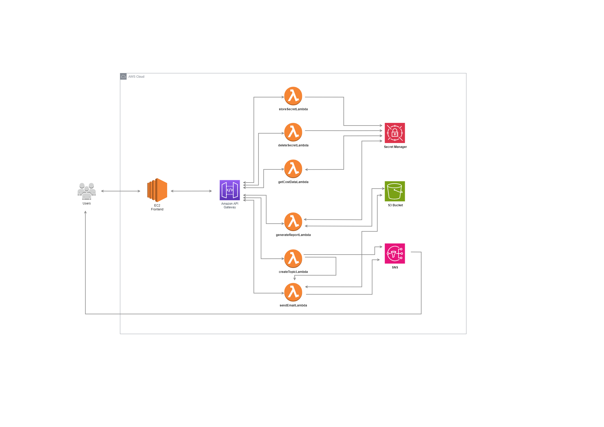
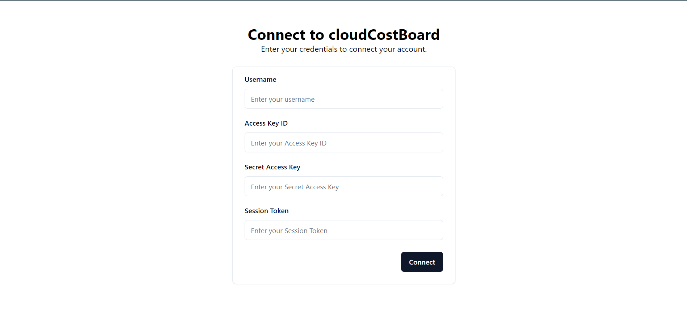
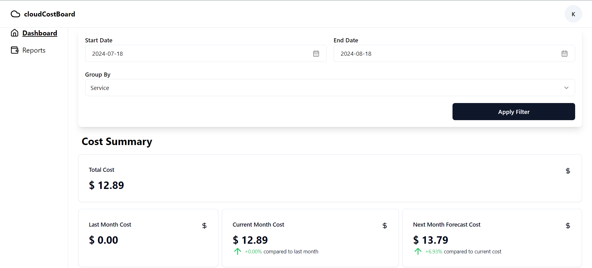
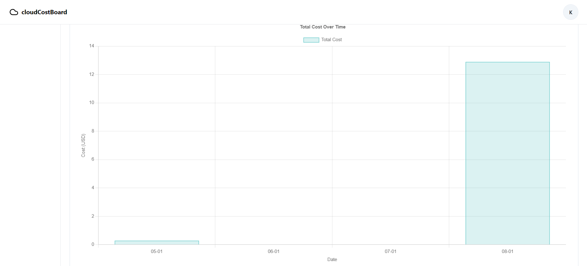
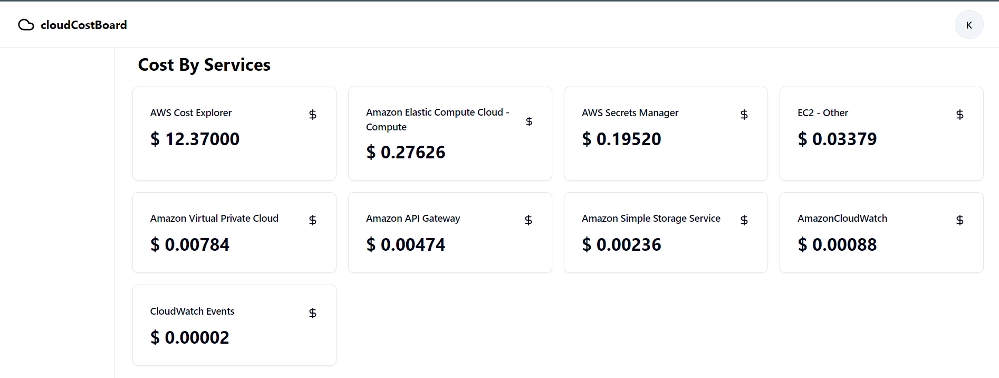
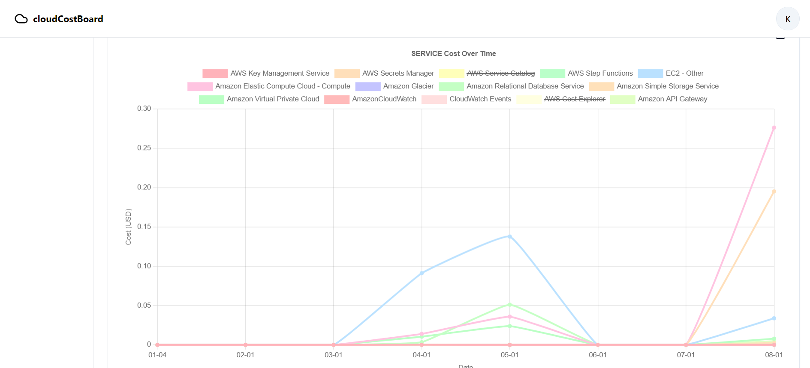
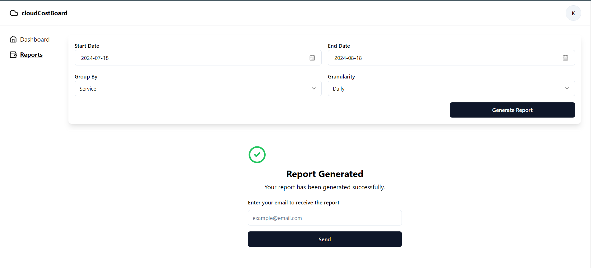

# 🌩️ cloudCostBoard 🌩️

## Overview

cloudCostBoard is a comprehensive AWS cost management dashboard designed to help users efficiently monitor and manage their AWS account costs. With filtering options, cost visualization, report generation, and secure credential management, cloudCostBoard provides a seamless and user-friendly experience for AWS cost management.

## Features

- **Advanced Filtering**: Apply a date range filter and gain cost insights by grouping cost by service, region, or account.
- **Cost Visualization**: View cost trends over time through intuitive graphs to analyze and understand spending patterns.
- **Report Generation**: Generate detailed reports by applying filters. Users can enter their email address to receive a report URL via email.
- **Secure AWS Credential Management**: AWS credentials are securely stored using AWS Secrets Manager, ensuring data protection and privacy.
- **Enhanced Security**: Secure transmission of AWS credentials between frontend and backend using CryptoJS for encryption.

## Technologies Used

- **Frontend**: Deployed as a Docker container on AWS EC2, built with React.js.
- **Backend**: Entirely serverless, powered by AWS Lambda, with API Gateway handling routing.
- **Storage**: Reports are stored in Amazon S3, with AWS SNS used for sending presigned URLs.
- **Security**: AWS Secrets Manager for securely storing AWS credentials and CryptoJS for encrypted data transmission.

## Future Work Scope

Looking ahead, I plan to expand CloudCostBoard by integrating support for other cloud providers, such as GCP and Azure, offering users a more comprehensive multi-cloud cost management tool. Additionally, I aim to introduce alert features that will notify users via email about significant changes in their spending patterns. Users will also be able to set these alerts for specific services, providing even more control over their cloud costs. Another enhancement will include more granular details of service usage, providing deeper insights into data consumption across individual services.

## Architecture

The cloudCostBoard architecture is fully serverless, ensuring scalability and efficiency. The frontend is deployed as a Docker image on EC2, while backend operations are managed through AWS Lambda functions. API Gateway serves as the bridge between the frontend and backend. Reports are generated and stored in S3, with notifications sent via SNS, allowing users to easily access their data.

